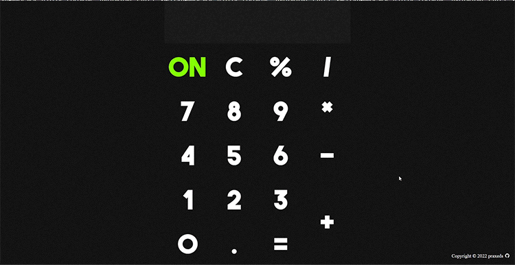

<!-- PROJECT LOGO -->
 

  

  <h3 align="center">The Odin Project | Calculator</h3>

  

    On-screen calculator using JavaScript, HTML, and CSS. Part of The Odin Project's Foundations curriculum.
     
     
    <a href="https://praxeds.github.io/theodinproject-calculator">Live Demo</a>
    ·
    <a href="https://codepen.io/praxeds/pen/KKeypBW">Codepen</a>
    ·
    <a href="https://www.theodinproject.com/">The Odin Project</a>
  

<!-- CONTACT -->
## Contact

Juliana Praxedes - contact@julianapraxedes.com

Project Link: [https://github.com/praxeds/theodinproject-calculator](https://github.com/praxeds/theodinproject-calculator)

(<a href="#top">back to top</a>)

<!-- Resources -->
## Resources

* Icon by [ionicons](https://ionic.io/ionicons)
* Sound Effects by [Pixabay](https://pixabay.com/sound-effects)

(<a href="#top">back to top</a>)
